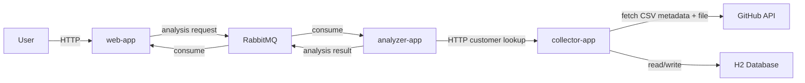

# Loan System

## Overview

This repository contains a small distributed loan-processing system built with three Spring Boot applications:

- `web-app`: user-facing API for requesting loan reports
- `analyzer-app`: loan eligibility processor
- `collector-app`: customer data service and banking dataset importer

The project demonstrates:

- REST communication between services
- asynchronous messaging with RabbitMQ
- fetching data from an external API
- storing imported data in a relational database
- schema management with Flyway

The application is not hosted publicly and is intended to run locally.

## Flow

1. A client requests a report from `web-app`
2. `web-app` publishes an analysis request to RabbitMQ
3. `analyzer-app` consumes the request and fetches customer data from `collector-app`
4. `analyzer-app` computes loan offers and publishes the result
5. `web-app` returns the completed report

For the data-ingestion requirement, `collector-app` fetches the Banking-Dataset from GitHub, parses the CSV, stores banking rows in H2, and derives customer rows used by the rest of the system.

## Architecture



## Design Summary

- Split into three applications so request handling, analysis, and data ownership stay separate
- RabbitMQ is used to decouple report requests from analysis work
- H2 was chosen because it is simple to run locally and easy to grade
- SQL was preferred over NoSQL because the imported banking dataset is structured and tabular
- Flyway keeps the schema explicit and reproducible in source control

## Requirements

### Functional

- Request a loan report by email
- Send analysis requests asynchronously
- Retrieve customer data from `collector-app`
- Evaluate loan eligibility and return offers
- Fetch banking data from an external API
- Store imported data in a database
- Create schema through migrations
- Expose imported record count

### Non-Functional

- Easy to run locally
- Clear separation of responsibilities
- Reproducible database setup
- Testable service boundaries
- Avoid duplicate imports when data already exists

## Testability

- `collector-app` tests cover customer flows and dataset import behavior
- `analyzer-app` tests cover loan eligibility and message handling
- `web-app` tests cover report request and controller behavior
- Integration tests run against migrated tables, which helps validate schema setup


Import behavior:

- `collector-app` imports the dataset on startup when `banking_records` is empty
- it reads the GitHub `download_url`, downloads the CSV, and stores the rows in `banking_records`
- customer rows are derived from the imported data and stored in `customers`

## Run

Start RabbitMQ:

```bash
docker run -d --hostname rabbit --name rabbit -p 5672:5672 -p 15672:15672 rabbitmq:3-management
```

Start the applications:

```bash
./gradlew :collector-app:bootRun
./gradlew :analyzer-app:bootRun
./gradlew :web-app:bootRun
```

Manual checks:

```bash
curl -X POST http://localhost:8081/collector/import
curl http://localhost:8081/collector/import/summary
curl "http://localhost:8080/web/report?email=prashant@example.com"
```

## Build And Test

```bash
./gradlew build
./gradlew test
```
